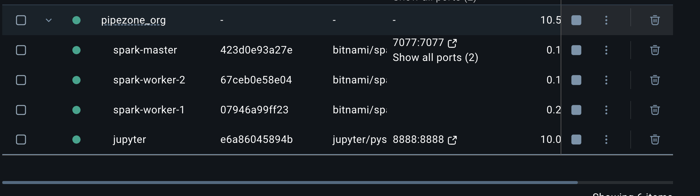
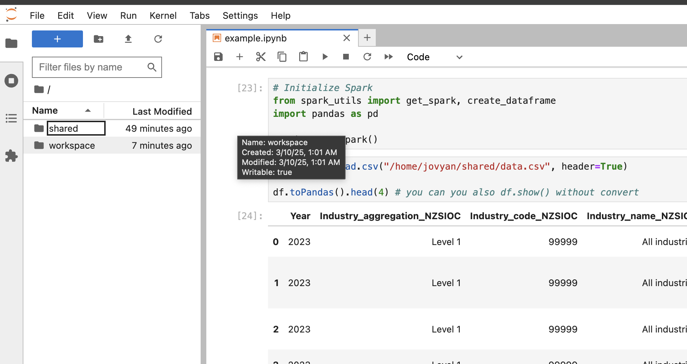
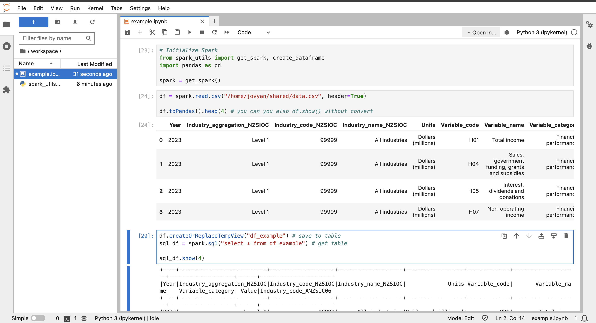

## 🚀 Pipezone

**Pipezone** is a lightweight, scalable, and fully containerized data processing environment. It provides an easy-to-use Apache Spark setup with dynamic worker scaling, Jupyter Notebook for interactive development, and shared storage for seamless data access.

### 📌 Features

- **Apache Spark**: Master-worker architecture with dynamic worker scaling
- **Jupyter Notebook**: Pre-configured for PySpark and SQL magic
- **Shared Workspace**: Easily share code and data between services
- **SQL Magic**: Run SQL queries directly within Jupyter (`%sql` support)
- **One-Command Setup**: Deploy everything using `docker-compose`

### 📺 System Architecture



### 📦 Installation

#### Prerequisites

Ensure you have the following installed:

- [Docker](https://www.docker.com/get-started)
- [Docker Compose](https://docs.docker.com/compose/install/)

#### Setup

Clone the repository and navigate into the project directory:

```sh
git clone https://github.com/your-repo/pipezone_org.git
cd pipezone_org
```

Run the setup:

```sh
docker-compose up -d
```

### 🔗 Access Services

| Service      | URL                                     |
| ------------ | --------------------------------------- |
| **Spark UI** | [127.0.0.1:8080](http://127.0.0.1:8080) |
| **Jupyter**  | [127.0.0.1:8888](http://127.0.0.1:8888) |

> **Note:** By default, Jupyter runs without authentication. If it's not accessible, check the Docker log for the authentication token URL.

### 📂 Shared Workspace



### 📝 Usage

#### Running a Simple Spark Job

Inside Jupyter, open a new Python notebook and run:

```python
# Set up Spark environment
from spark_utils import get_spark

spark = get_spark()
df = spark.read.csv("/home/jovyan/shared/data.csv", header=True)
df.toPandas().head(4)  # You can also use df.show() without converting
```

#### Running SQL Queries

```python
%load_ext sql
%sql spark

%sql SELECT * FROM df
```

### 📓 Jupyter Notebook Example



### 🚫 Stopping and Removing Containers

To stop all running containers:

```sh
docker-compose down
```

To remove all containers and volumes:

```sh
docker-compose down -v
```

### 👨‍💻 Contributing

1. Fork the repository
2. Create a new branch (`git checkout -b feature-branch`)
3. Commit your changes (`git commit -m 'Add new feature'`)
4. Push to the branch (`git push origin feature-branch`)
5. Open a Pull Request

### 📝 License ... 

This project is licensed under the MIT License. See `LICENSE` for details.

---

🚀 **PipeZone** - Simplifying Big Data Processing!
